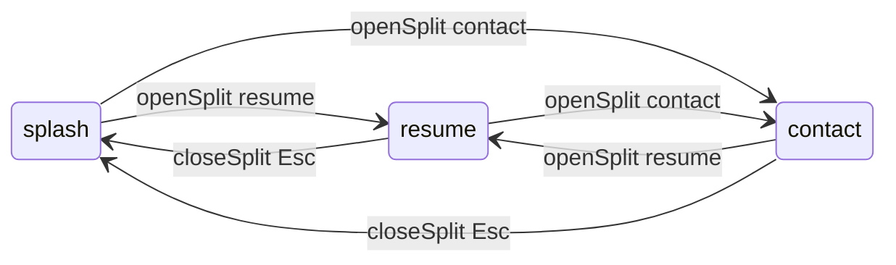

# Splash redesign — consolidated mood board

Single reference for implementing the **boot-index** direction in Hono + TypeScript + Rust/WASM.  
**Canonical prototype:** [`boot-index.html`](./boot-index.html) — production `/` must match this layout (split shell, chrome, dock, query block). Production adds telemetry strip, theme toggle, and WASM search (M3–M4) without reverting to the scroll portfolio.

---

## Product shape

| Mode      | Layout                       | Scroll | Right pane          |
| --------- | ---------------------------- | ------ | ------------------- |
| `splash`  | Full-viewport boot shell     | locked | hidden              |
| `resume`  | Vertical split (~42% / ~58%) | locked | `resume.pdf` iframe |
| `contact` | Same split                   | locked | contact form (SSR)  |

Switching resume ↔ contact **cross-fades** the right pane; split stays open.  
`Esc` closes split → `splash`. Hash: `#resume`, `#contact`.

---

## Visual tokens

Mirror [`apps/site/src/styles/global.css`](../../apps/site/src/styles/global.css). Splash uses a **subset** — no new palette.

```css
/* Semantic aliases for splash shell */
--splash-bg: var(--color-background); /* #151b22 dark */
--splash-surface: var(--color-surface); /* #1d2630 */
--splash-surface-up: var(--color-surface-raised); /* #25313e */
--splash-text: var(--color-maintext);
--splash-subtext: var(--color-subtext);
--splash-muted: var(--color-muted);
--splash-accent: var(--color-accent-text); /* links, active */
--splash-accent-fill: var(--color-accent); /* primary buttons */
--splash-ok: #76ffd5; /* boot ok, success */
--splash-rule: var(--color-rule);

--splash-font-ui: var(--font-body); /* Inter */
--splash-font-mono: "IBM Plex Mono", monospace; /* add if not global */
--splash-font-display: var(--font-heading); /* Space Grotesk — name only */

--splash-ease: cubic-bezier(0.16, 1, 0.3, 1);
--splash-split-open: 780ms;
--splash-split-close: 620ms;
--splash-crossfade: 450ms;

--split-progress: 0; /* 0–1, TS → CSS + WASM */
--split-left: calc(100% - var(--split-progress) * 58%);
```

### Typography scale

| Role                | Font          | Size                       | Weight |
| ------------------- | ------------- | -------------------------- | ------ |
| Name                | Space Grotesk | `clamp(1.6rem, 5vw, 2rem)` | 600    |
| Boot log / commands | IBM Plex Mono | `0.8rem`                   | 400    |
| Chrome bar          | IBM Plex Mono | `0.7rem`                   | 500    |
| Form labels         | IBM Plex Mono | `0.66rem` uppercase        | 600    |
| Form inputs         | Inter         | `0.9rem`                   | 400    |

### Component rules

- **One** filled button style (Send, Download).
- Everything else: `1px` border, `0.5–0.65rem` radius, hover brighten.
- No section eyebrows on splash.
- Icon dock: 2.5rem squares, Simple Icons brands + Lucide utility.
- Right chrome: status dot (blue = resume, mint = contact) + filename + actions.

---

## Wireframes

### Splash (`data-site-mode="splash"`)

```
┌──────────────────────────────────────────────────────────────────────────┐
│ ← drafts                                          [lattice field bg]    │
│                                                                          │
│              ┌─────────────────────────────────────┐                      │
│              │ yanai.sh / boot + index              │                      │
│              │ Yanai Klugman|                       │                      │
│              │ ok identity loaded                   │                      │
│              │ ok search index mounted              │                      │
│              │ ok contact handler ready             │                      │
│              │ > awaiting query_                    │                      │
│              │ ─────────────────────────────────    │                      │
│              │ > ⌕ query  [ integration, rust… ]  │                      │
│              │ > resume                             │                      │
│              │ > contact                            │                      │
│              │ [gh] [in] [✉] [pdf]                  │                      │
│              └─────────────────────────────────────┘                      │
│                                                                          │
│  hint: / query · C contact · drag divider when split open                 │
└──────────────────────────────────────────────────────────────────────────┘
```

### Resume split (`data-site-mode="resume"`)

```
┌──────────────────────────────│├──────────────────────────────────────────┐
│  (boot panel, scrollable)    │ ● resume.pdf          [open] [↓download] [×]│
│  same as splash, narrower    ├──────────────────────────────────────────┤
│                              │                                          │
│                              │         ┌──────────────────────┐         │
│                              │         │                      │         │
│                              │         │   resume.pdf         │         │
│                              │         │   (iframe)           │         │
│                              │         │                      │         │
│                              │         └──────────────────────┘         │
│                              │                                          │
│  lattice clipped to left ────┤  WASM glow on divider ───────────────────│
└──────────────────────────────┴──────────────────────────────────────────┘
        ~42% draggable               ~58%
```

### Contact split (`data-site-mode="contact"`)

```
┌──────────────────────────────│├──────────────────────────────────────────┐
│  (boot panel)                │ ● contact · send a note              [×] │
│                              ├──────────────────────────────────────────┤
│                              │  Email me.                               │
│                              │  Send a short note…                      │
│                              │  NAME    [____________]                  │
│                              │  EMAIL   [____________]                  │
│                              │  MESSAGE [____________]                  │
│                              │  [ turnstile on deploy ]                 │
│                              │  [ Send ]                                │
└──────────────────────────────┴──────────────────────────────────────────┘
        mint divider glow (contact target)
```

### Mobile (`max-width: 720px`)

Split open → **right pane full width**, splash hidden (same as draft).

---

## WASM uniform API

### Today (`SystemsFieldRenderer`)

```rust
// apps/wasm/canvas/src/lib.rs
impl SystemsFieldRenderer {
    fn new(canvas, seed: u32, quality: u32) -> Self;
    fn resize(width, height, dpr) -> Result<()>;
    fn set_pointer(x: f64, y: f64);      // normalized 0..1
    fn set_theme(theme: u32);            // 0 dark, 1 light
    fn set_page_phase(phase: u32);       // 0 home, 1 career, 2 projects, 3 contact
    fn render(time_ms: f64) -> Result<u32>;
    fn metrics() -> JsValue;
    fn dispose();
}
```

`portfolio-root-client.ts` drives `page_phase` from scroll-section `IntersectionObserver` — **remove** for splash redesign (no scroll sections).

### Proposed additions (splash split)

```rust
/// 0 = full viewport ambient, 1 = split fully open
fn set_split_progress(&mut self, t: f32);

/// 0 = resume (blue accent), 1 = contact (mint accent)
fn set_split_target(&mut self, target: u32);

/// Optional: 0..1 boot sequence on first paint (nodes connect in waves)
fn set_boot_progress(&mut self, t: f32);

/// Optional: search hit — pull field toward point (normalized coords)
fn set_focus(&mut self, x: f32, y: f32, strength: f32);
```

### Render behaviour (Rust)

| Uniform                    | Visual                                                                        |
| -------------------------- | ----------------------------------------------------------------------------- |
| `split_progress`           | Clip field to left pane width; fade density on right; brighten divider column |
| `split_target`             | Lerp stroke/fill accent blue ↔ mint                                           |
| `split_progress` + pointer | Bias node wake toward right edge (data flowing into pane)                     |
| `boot_progress`            | Ramp node/link alpha 0→1 over first ~1.5s                                     |
| `focus`                    | Localized pull + pulse at `(x,y)` when search highlights a hit                |

### TypeScript bridge (`portfolio-root-client.ts` → `splash-client.ts`)

```ts
type SiteMode = "splash" | "resume" | "contact";
type SplitTarget = "resume" | "contact";

type SplashController = {
  openSplit(target: SplitTarget, hint?: string): void;
  closeSplit(): void;
  setSplitRatio(percent: number): void; // 22–68, from divider drag
};

// During open/close animation (rAF loop):
renderer.set_split_progress(easedT);
renderer.set_split_target(target === "contact" ? 1 : 0);

// On theme toggle (existing):
renderer.set_theme(themeId);

// On search match (when search WASM wired):
renderer.set_focus(normX, normY, 0.6);
```

### Deprecate for `/` splash

- `set_page_phase` driven by scroll sections (career/projects/contact)
- `initNav` hash scroll, `initTopButton`
- Section `IntersectionObserver` for phase

Keep `set_page_phase` internally mapped if useful:

| Mode    | Internal phase                     |
| ------- | ---------------------------------- |
| splash  | `0` (home)                         |
| resume  | `1` (reuse career slot) or new `4` |
| contact | `3` (contact)                      |

Prefer **new uniforms** over overloading `page_phase` — clearer intent.

---

### Target home page

```tsx
// apps/site/src/views/splash-page.tsx + splash-layout.tsx
<SplashLayout title={portfolio.pageTitle} pathname="/">
  <SplashShell /> {/* markup in splash-page.tsx */}
</SplashLayout>
```

### Production files

| File                       | Role                                               |
| -------------------------- | -------------------------------------------------- |
| `views/splash-page.tsx`    | Boot panel + split pane markup                     |
| `views/splash-layout.tsx`  | HTML shell, WASM layer, client script              |
| `scripts/splash-client.ts` | State machine, split animation, WASM, search mount |
| `styles/splash.css`        | Splash shell styles                                |
| `wasm/canvas/src/lib.rs`   | `set_split_progress`, `set_split_target`           |

### Data sources

| Content             | Source                                             |
| ------------------- | -------------------------------------------------- |
| Name, socials       | `portfolio/profile.ts`                             |
| Contact copy + form | `portfolio/contact.ts` + existing Turnstile script |
| Resume              | **`/resume.pdf` only** in split (no HTML resume)   |
| Search index        | `@resume/generated` via `wasm/search` (phase 2)    |

### SSR + progressive enhancement

```html
<html data-site-mode="splash">
  <div class="split-pane" inert>
    <!-- form + empty iframe present in HTML for crawlers -->
  </div>
</html>
```

- Without JS: show splash copy + links to `/resume.pdf` and `mailto:`.
- With JS: split + WASM; lazy-load canvas + PDF src on first `openSplit('resume')`.

---

## TypeScript state machine



```ts
// lib/splash-state.ts (sketch)
const EASE = (t: number) => 1 - (1 - t) ** 4;

function openSplit(target: SplitTarget) {
  if (mode === "splash") animateSplitProgress(0, 1, 780);
  setMode(target);
  showPane(target);
  syncHash(target);
  if (target === "resume") ensurePdfLoaded();
  if (target === "contact") focusFirstField();
}

function closeSplit() {
  animateSplitProgress(splitProgress, 0, 620, () => {
    setMode("splash");
    pane.setAttribute("inert", "");
  });
}
```

Events:

| Input                              | Action                                           |
| ---------------------------------- | ------------------------------------------------ |
| `> resume`, PDF icon, search Enter | `openSplit('resume')`                            |
| `> contact`, mail icon, `C`        | `openSplit('contact')`                           |
| `Esc`, chrome `×`                  | `closeSplit()`                                   |
| Divider drag                       | `setSplitRatio` → CSS `--split-left` + WASM clip |
| `#resume` / `#contact` on load     | `openSplit` from hash                            |

---

## Search (phase 2)

```
User types in query input
  → debounce 80ms
  → Comlink worker → wasm/search SearchIndex
  → results list in splash panel
  → Enter or click → openSplit('resume', hint)
  → renderer.set_focus(x, y, strength) optional
```

Mock in draft uses `Array.filter`; production uses Nucleo — **only difference** in results UI.

---

## Implementation phases

### M1 — Shell without WASM changes

- [ ] Replace `index.astro` sections with `SplashShell` + `SplitPane`
- [ ] `splash-client.ts`: split CSS vars, open/close, divider drag
- [ ] PDF iframe lazy load + download/open chrome
- [ ] Contact form in right pane (reuse `contact.astro` logic)
- [ ] Remove nav / scroll / back-to-top on `/`
- [ ] Smoke: splash no scroll; `#resume` opens split; form visible on `#contact`

### M2 — WASM split uniforms

- [ ] `set_split_progress`, `set_split_target` in canvas crate
- [ ] TS animation loop drives uniforms (replace JS lattice stub)
- [ ] Clip + divider glow in Rust
- [ ] `set_boot_progress` optional on first paint

### M3 — Search WASM

- [ ] Mount search worker from splash query input
- [ ] `set_focus` on match
- [ ] Index from `@resume/generated`

### M4 — Polish

- [ ] Real telemetry dot in chrome (optional, from `/api/telemetry/stats`)
- [ ] Light theme pass on split chrome
- [ ] `prefers-reduced-motion`: instant split, static CSS grid bg

---

## What we are not building

- HTML resume rendering on `/`
- Scrollable career/projects/contact sections on first visit
- Contact modal overlay (split only)
- SharedArrayBuffer / bridge WASM on `/`
- WebGL / wgpu for splash

---

## Success criteria

1. First paint feels like **one app viewport**, not a portfolio scroll.
2. Resume is **the PDF** — download works, preview in split.
3. Contact form works in split with existing `/api/contact` + Turnstile.
4. WASM reacts visibly when split opens (clip + divider), invisibly at rest.
5. `bun run verify` + smoke pass; no COOP/COEP changes on `/`.

---

## Quick reference: draft → production mapping

| Draft (`boot-index.html`)      | Production                                            |
| ------------------------------ | ----------------------------------------------------- |
| `--split-progress` CSS var     | `root.style.setProperty` + WASM `set_split_progress`  |
| `data-site-mode`               | `document.documentElement.dataset.siteMode`           |
| `pane--detail`                 | `SplitPane.astro`                                     |
| `view-resume` / `view-contact` | `PaneResume` / `PaneContact`                          |
| JS canvas lattice              | `SystemsFieldRenderer`                                |
| Mock form submit               | `contact.astro` fetch to `/api/contact`               |
| `PDF_URL` fallback             | `resume.pdf.ts` route + `RESUME_REPO_TOKEN` on deploy |
